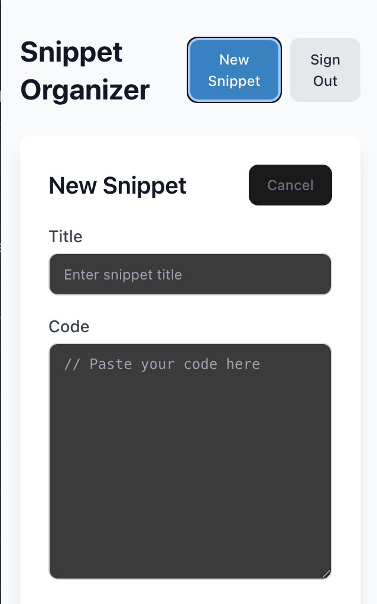
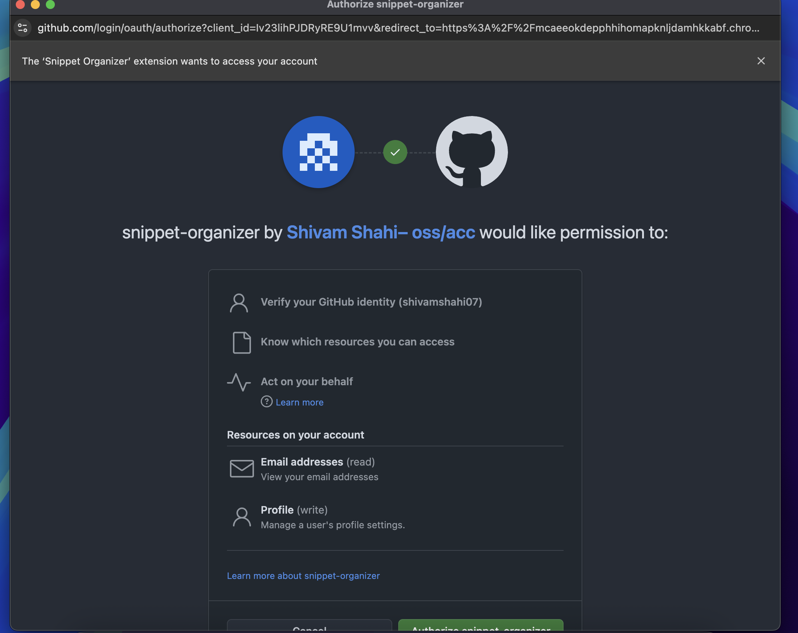
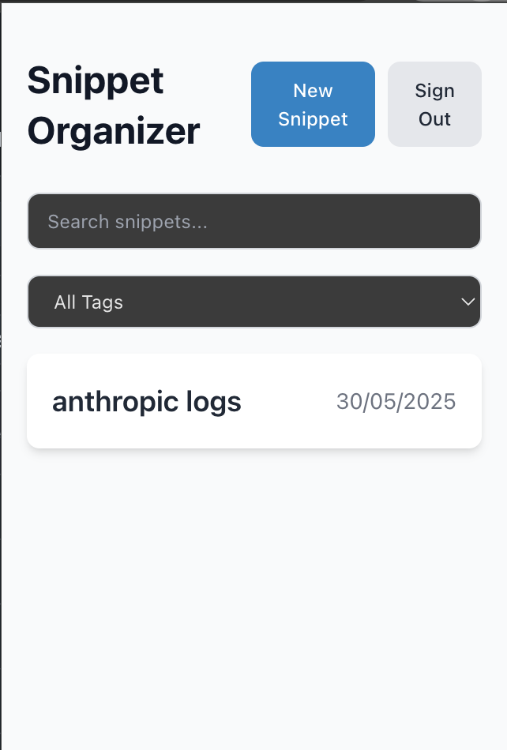
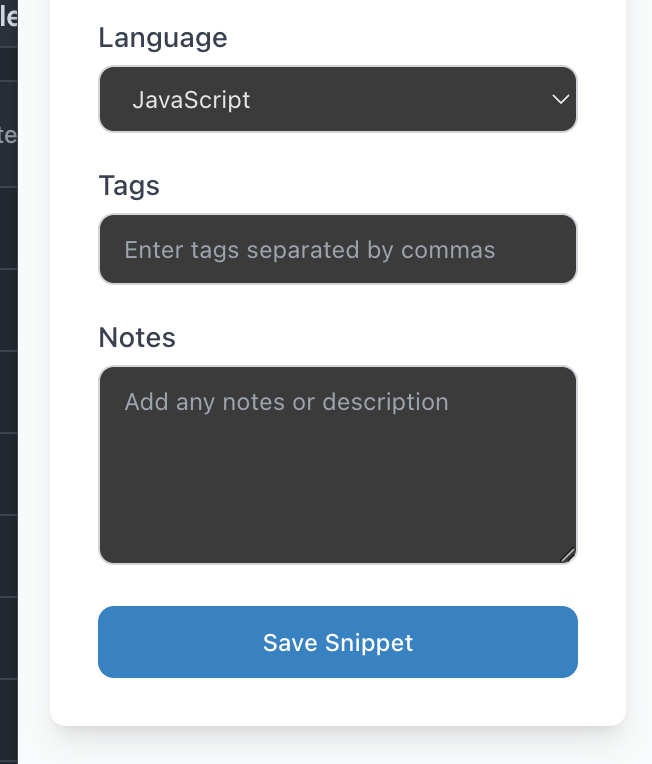
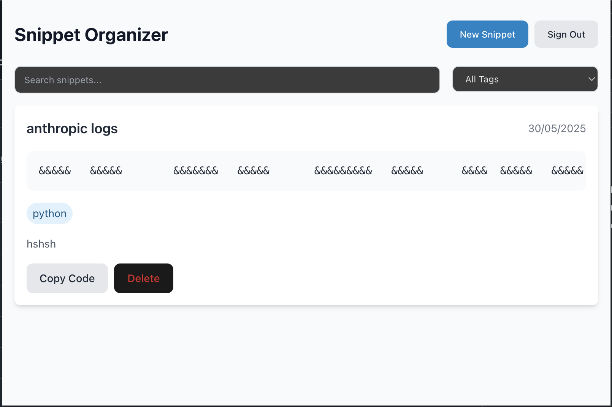
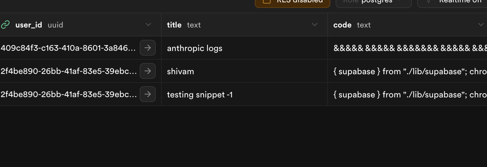
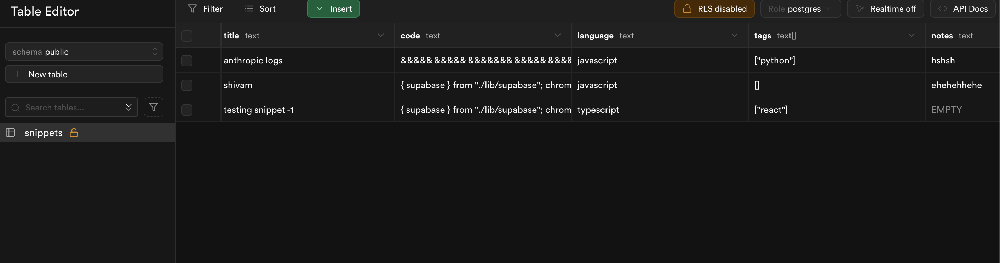
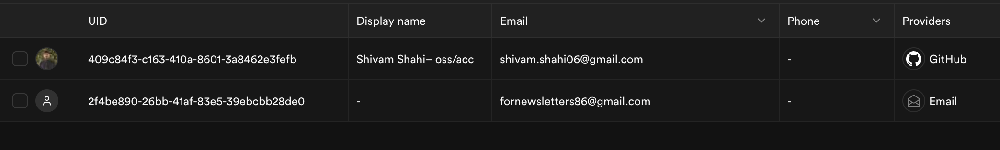

# Snippet Organizer - Chrome Extension

A modern, secure Chrome extension for organizing and managing code snippets, built with React, Vite, TypeScript, and Supabase.

## Features

### 1. Secure Authentication

- GitHub OAuth integration for secure user authentication
- Implements PKCE (Proof Key for Code Exchange) flow for enhanced security
- Custom Chrome extension OAuth flow handling using `chrome.identity`
- Persistent sessions with secure token storage using `chrome.storage.local`

### 2. Snippet Management

- Create and store code snippets with titles, descriptions, and tags
- Syntax highlighting for multiple programming languages
- Secure storage in Supabase with Row Level Security (RLS)
- Each user can only access their own snippets
- Real-time snippet updates and deletions

### 3. User Interface

- Modern, responsive design using Tailwind CSS
- Dark/Light theme support
- Intuitive snippet organization with tags
- Quick copy-to-clipboard functionality
- Search and filter snippets by title or tags

## Technical Implementation

### Authentication Flow

1. **GitHub OAuth Setup**

   - Implemented custom OAuth flow using `chrome.identity`
   - Used PKCE flow for enhanced security
   - Handled token exchange and session management

2. **Session Management**
   - Custom storage adapter for Supabase using `chrome.storage.local`
   - Persistent authentication state across extension reopens
   - Secure token storage and management

### Data Security

1. **Row Level Security (RLS)**

   - Implemented database-level security policies
   - Each user can only access their own snippets
   - Protected against unauthorized access attempts

2. **Frontend Security**
   - Secure token handling
   - Protected API endpoints
   - Input validation and sanitization

### Extension Architecture

1. **Background Service Worker**

   - Handles authentication flow
   - Manages extension lifecycle
   - Implements wake lock for persistent connections

2. **React Frontend**
   - Built with Vite for optimal performance
   - TypeScript for type safety
   - Component-based architecture for maintainability

## Development Journey

### Phase 1: Initial Setup

- Set up Vite with React and TypeScript
- Configured Chrome extension manifest
- Implemented basic UI components

### Phase 2: Authentication

- Integrated Supabase authentication
- Implemented GitHub OAuth flow
- Added PKCE security
- Handled Chrome extension specific OAuth challenges

### Phase 3: Core Features

- Developed snippet CRUD operations
- Implemented tag system
- Added search and filter functionality
- Enhanced UI/UX with Tailwind CSS

### Phase 4: Security & Polish

- Implemented Row Level Security
- Added proper error handling
- Enhanced user feedback
- Improved performance and reliability

## Local Development

1. Clone the repository

```bash
git clone https://github.com/shivamshahi07/SnippetVault
cd snippet-organizer-vite
```

2. Install dependencies

```bash
npm install
```

3. Create a `.env` file with your Supabase credentials

```env
VITE_SUPABASE_URL=your_supabase_url
VITE_SUPABASE_ANON_KEY=your_supabase_anon_key
```

4. Run development server

```bash
npm run dev
```

5. Build for production

```bash
npm run build
```

## Screenshots



## Future Enhancements

1. **Planned Features**

   - Snippet sharing capabilities
   - More authentication providers
   - Enhanced code editor features
   - Snippet categories and folders
   - Export/Import functionality

2. **Technical Improvements**
   - Offline support
   - Real-time collaboration
   - Enhanced search with code content
   - Performance optimizations

## Contributing

Contributions are welcome! Please feel free to submit a Pull Request.

## License

MIT License

Copyright (c) 2025 Shivam Shahi

Permission is hereby granted, free of charge, to any person obtaining a copy
of this software and associated documentation files (the "Software"), to deal
in the Software without restriction, including without limitation the rights
to use, copy, modify, merge, publish, distribute, sublicense, and/or sell
copies of the Software, and to permit persons to whom the Software is
furnished to do so, subject to the following conditions:

The above copyright notice and this permission notice shall be included in all
copies or substantial portions of the Software.

THE SOFTWARE IS PROVIDED "AS IS", WITHOUT WARRANTY OF ANY KIND, EXPRESS OR
IMPLIED, INCLUDING BUT NOT LIMITED TO THE WARRANTIES OF MERCHANTABILITY,
FITNESS FOR A PARTICULAR PURPOSE AND NONINFRINGEMENT. IN NO EVENT SHALL THE
AUTHORS OR COPYRIGHT HOLDERS BE LIABLE FOR ANY CLAIM, DAMAGES OR OTHER
LIABILITY, WHETHER IN AN ACTION OF CONTRACT, TORT OR OTHERWISE, ARISING FROM,
OUT OF OR IN CONNECTION WITH THE SOFTWARE OR THE USE OR OTHER DEALINGS IN THE
SOFTWARE.

---

## Application Screenshots

### Login and Authentication




### Core Features





### Additional Features



